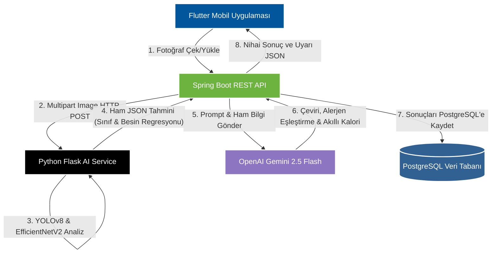

# <p align="center">🥗 NutriScan 📸</p>
<h3 align="center">Yapay Zeka Destekli Mobil Kalori ve Besin Değeri Takip Platformu</h3>

<p align="center">
  
  
  
  
  
  
</p>

---
mp4
## 📌 Proje Hakkında

**NutriScan**, bireysel sağlık yönetiminde beslenme takibini kolaylaştırmak amacıyla geliştirilmiş, uçtan uca yapay zeka destekli akıllı bir mobil kalori ve besin değeri takip sistemidir. Geleneksel diyet uygulamalarının getirdiği yüksek bilişsel yükleri ve kısıtlamaları aşmak amacıyla tasarlanan bu proje, Yalova Üniversitesi Bilgisayar Mühendisliği Bölümü **Bitirme Tezi** kapsamında hayata geçirilmiştir.

### 🔍 Çözülen Temel Sorunlar
1. **Manuel Veri Girişi Zorluğu (Bilişsel Yük):** Klasik uygulamalardaki elle gıda arama ve porsiyon yazma süreci yerine, sadece bir fotoğraf çekilerek **saniyeler içinde** yemeğin tespiti ve besin değerlerinin tahmini yapılır.
2. **Yerel Türk Mutfağı Eksikliği (Katastrofik Unutma):** Küresel gıda veri kümelerindeki (örn. Food-101) modeller yerel Türk yemeklerini (Lahmacun, Kuru Fasulye vb.) tanıyamaz. Model sadece Türk yemekleriyle eğitildiğinde ise küresel yemekleri unutur (Catastrophic Forgetting). NutriScan, bu problemi **birleşik veri setiyle sıfırdan eğitilen YOLOv8m-cls** modeliyle çözmüştür.
3. **Kişiselleştirilmiş Alerjen Hassasiyeti Güvenliği:** Gıda alerjisi veya hassasiyeti (Gluten, Laktoz, Yumurta vb.) olan bireyler için, tespit edilen yiyeceğin içeriği **Google Gemini 2.5 Flash** ile taranarak gerçek zamanlı alerjen uyarıları üretilir.

---

## 📽️ Proje Tanıtım Videosu

Aşağıdaki videodan uygulamanın çalışmasını, kullanıcı onboarding sürecini, yemek analiz akışını ve alerjen güvenlik mekanizmalarını izleyebilirsiniz:

<p align="center">
  <video src="download.mp4" width="75%" controls>
    

https://github.com/user-attachments/assets/7bfe2a83-e60c-488c-84bc-ca9106492156


  </video>
</p>

> [!NOTE]
> Detaylı ekran kayıtları ve geliştirme aşamasındaki test videolarına da (https://github.com/zeynepttr/NutriScan/tree/master/ekran%20g%C3%B6r%C3%BCnt%C3%BCleri) yolundan erişebilirsiniz.

---

## 🛠️ Sistem Mimarisi ve Veri Akışı

NutriScan, modüler ve ölçeklenebilir 4 katmanlı (client-server) bir mimariye sahiptir:



### Katman Detayları
* **İstemci (Flutter):** Durum yönetimi için `Provider` mimarisi kullanan, asenkron REST HTTP istekleriyle çalışan çapraz platform mobil uygulama.
* **Ana Sunucu (Spring Boot):** JWT güvenlik doğrulaması, veri tabanı yönetimi (Spring Data JPA) ve servis koordinasyonunu sağlayan çekirdek katman.
* **Yapay Zeka Sunucusu (Flask AI API):** YOLOv8m-cls ve regresyon özelleştirmeli EfficientNetV2 modellerini GPU/CPU üzerinde çalıştıran Python mikroservisi.
* **LLM Entegrasyonu (Gemini 2.5 Flash):** Görüntü modellerinin ham çıktılarını Türkçeleştiren, alerjen uyuşmazlıklarını analiz eden ve Mifflin-St Jeor parametrelerine göre günlük hedefleri belirleyen bulut entegrasyon katmanı.

---

## 🧠 Yapay Zeka Modelleri ve Başarı Metrikleri

Uygulamada iki farklı derin öğrenme mimarisi ve bir büyük dil modeli entegre çalışmaktadır:

### 1. Yemek Sınıflandırma: YOLOv8m-cls
* **Amaç:** Fotoğraftaki yemeğin türünü belirlemek.
* **Katastrofik Unutma Çözümü:** Evrensel Food-101 ve yerel Türk yemekleri veri kümeleri birleştirilerek model sıfırdan eğitilmiştir.
* **Başarı Metrikleri:**
  * **Top-1 Doğruluk (Accuracy):** `%70.7`
  * **Top-5 Doğruluk (Accuracy):** `%92.2` (Alternatif tahminler listesiyle kullanıcıya seçim kolaylığı sunar)

### 2. Besin Regresyonu: EfficientNetV2
* **Amaç:** Yemeğin sınıfından bağımsız olarak doğrudan görsel piksellerinden besin değerlerini tahmin etmek.
* **Veri Kümesi:** Nutrition5k (5000+ tabak görseli ve terazi ölçümlü besin değeri).
* **Z-Score Normalizasyonu:** Regresyon stabilitesi için eğitim öncesinde normalize edilen hedefler, tahmin anında `nutriscan_stats.json` değerleri kullanılarak denormalize edilir.
* **Hata Metrikleri (MAE - Ortalama Mutlak Hata):**
  * **Kalori:** `151.8 kcal` sapma.
  * **Protein / Karbonhidrat / Yağ:** `~10-19 g` sapma.

### 3. Akıllı LLM Katmanı: Gemini 2.5 Flash
* **Doğal Dil Çevirisi:** `cup_cakes` gibi ham sınıf isimlerini kullanıcı dostu Türkçe adlara dönüştürür.
* **Alerjen Kontrolü:** Kullanıcı alerjen listesi (örn: süt, yumurta, gluten) ile yemek içeriğini (örn: cupcake) karşılaştırır ve eşleşme durumunda kırmızı uyarı etiketi üretir.
* **Kişiselleştirilmiş Kalori:** Kullanıcının yaş, boy, kilo, cinsiyet ve aktivite parametreleriyle Mifflin-St Jeor bazlı BMR & TDEE hesaplarını yaparak kilo alma/verme hedefine göre günlük alınması gereken kaloriyi hesaplar.

---

## 🚀 Kurulum ve Çalıştırma Kılavuzu

Projenin tamamını yerel makinenizde ayağa kaldırmak için aşağıdaki adımları sırasıyla takip ediniz:

### 1. Veri Tabanı Kurulumu (PostgreSQL)
1. Yerel makinenizde PostgreSQL'in kurulu ve aktif olduğundan emin olun.
2. `nutriscan` adında yeni bir veritabanı oluşturun:
   ```sql
   CREATE DATABASE nutriscan;
   ```
3. Varsayılan kullanıcı adı `postgres` ve şifrenin `123456` olduğundan emin olun. (Farklıysa Spring Boot `application.properties` dosyasından güncelleyebilirsiniz).

---

### 2. Yapay Zeka Flask API Kurulumu
AI mikroservisi Python 3.10+ ve PyTorch ile çalışmaktadır.

1. `/ai` dizinine geçin ve sanal ortam oluşturun:
   ```bash
   cd ai
   python -m venv .venv
   .venv\Scripts\activate     # Windows için
   # source .venv/bin/activate # macOS/Linux için
   ```
2. Gerekli kütüphaneleri yükleyin:
   ```bash
   pip install flask torch torchvision ultralytics pillow
   ```
3. `best5.pt` ve `nutriscan_full.pt` model ağırlıklarının ve `nutriscan_stats.json` dosyasının `/ai` klasöründe yer aldığını doğrulayın.
4. Sunucuyu başlatın (varsayılan port `5000`):
   ```bash
   python app.py
   ```

---

### 3. Spring Boot Backend Kurulumu
Arka uç Java 17 ve Maven kullanmaktadır.

1. `/nutriscanbackend/nutriscanbackend` dizinine geçin.
2. `src/main/resources/application.properties` dosyasını açın ve Gemini API anahtarınızı tanımlayın:
   ```properties
   gemini.api.key=YOUR_GEMINI_API_KEY
   ```
   > [!TIP]
   > Gemini API anahtarı boş bırakılırsa, sistem otomatik olarak Mifflin-St Jeor ve yerel kelime/alerjen sözlüğü üzerinden kural tabanlı yedek algoritmaları (`fallback`) çalıştıracaktır.
3. Projeyi derleyin ve çalıştırın (port `8080`):
   ```bash
   mvnw spring-boot:run
   ```

---

### 4. Flutter Frontend Kurulumu
1. Android Studio veya VS Code üzerinde `/nutriscanfrontend` klasörünü açın.
2. `lib/constants/api_constants.dart` dosyasından API adresini kontrol edin:
   * Android Emülatör için: `http://10.0.2.2:8080`
   * Fiziksel cihaz ile test edecekseniz kendi yerel IP'nizi tanımlayın (örn. `http://192.168.1.100:8080`).
3. Bağımlılıkları çekin ve uygulamayı başlatın:
   ```bash
   flutter pub get
   ```
   ```bash
   flutter run
   ```

---

## 🛡️ Hata Toleransı ve Güvenlik Filtreleri

* **Düşük Güven Skoru Algılaması:** YOLOv8 modeli taranan görseli `%70` güven sınırının altında sınıflandırırsa (örneğin gıda dışı bir nesne tarandığında), uygulama kullanıcıyı uyararak taramanın hatalı olabileceğini belirtir. Kullanıcı isterse *"Yine de Sonucu İncele"* diyerek ham tahmini görüntüleyebilir.
* **Çevrimdışı / LLM Kesinti Modu:** Gemini API'sine erişilemediği veya kota dolumu durumunda sistem çökmelerini önlemek amacıyla Spring Boot tarafında yerel kelime çeviri veri tabanı ve statik alerjen kuralları devreye girer.

---


## 🎓 Proje Sahibi
* **Tez Öğrencisi:** Zeynep Tatar 
* **Kurum:** Yalova Üniversitesi, Mühendislik Fakültesi, Bilgisayar Mühendisliği Bölümü (2025-2026 Akademik Yılı)
